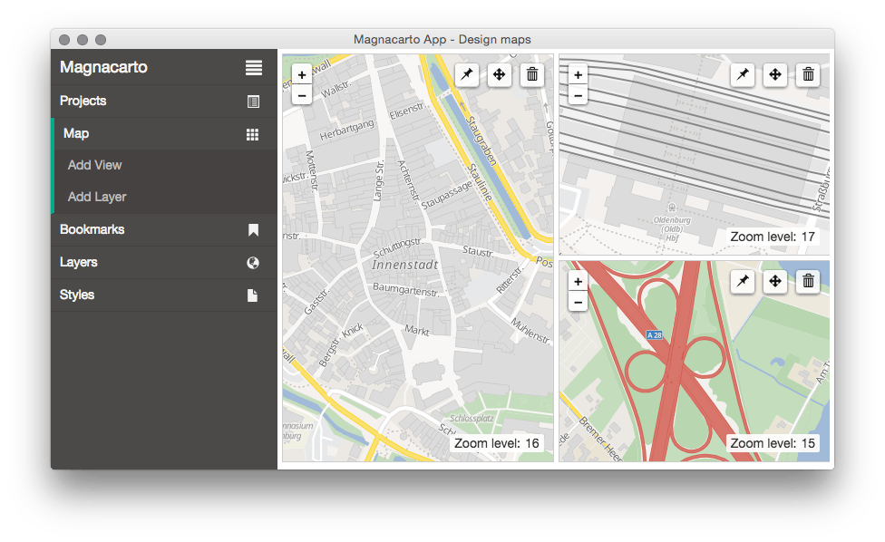

Magnacarto
==========

Magnacarto is a CartoCSS map style processor that generates Mapnik XML and MapServer map files.

It is released as open source under the [Apache License 2.0][].

[Apache License 2.0]: http://www.apache.org/licenses/LICENSE-2.0.html

Features
--------

* Easy to use map viewer

* Generate styles for Mapnik 3 and MapServer

#### MapServer

#### Mapnik

Current status
--------------

- Supports nearly all features of CartoCSS
  - Attachments
  - Instances
  - Classes
  - Color functions
  - Expressions
  - etc.
- Can successfully convert complex styles (like the OSM Carto style)

### Missing ###

- Not all CartoCSS features are supported by the MapServer builder
- Improved configuration
- ...

Installation
------------

### Source

#### Dependencies

You need [Go][]>1.12

[Go]: https://golang.org

#### Compiling

Check out or download the repository and call:

    make install

#### Render Plugins

The web-frontend of Magnacarto can render map images with Mapserver and Mapnik.

##### Mapserver

The Mapserver plugin is already included in the default `magnaserv` installation and it requires the `mapserv` binary in your `PATH` on runtime.

##### Mapnik

The Mapnik plugin needs to be compiled as an additional binary (`magnacarto-mapnik`). You need to have Mapnik installed with all header files. It supports 3. Make sure `mapnik-config` is in your `PATH`. Call `make install` to build the plugin binary.

Usage
-----

### magnacarto

`magnacarto` takes a single `-mml` file.

    magnacarto -mml project.mml > /tmp/magnacarto.xml

To build a MapServer map file:

    magnacarto -builder mapserver -mml project.mml > /tmp/magnacarto.map

See `magnacarto -help` for more options.

### magnaserv

Magnaserv is a web-frontend for Magnacarto. Make sure the `./app` directory is in your working directory or next to the `magnaserv` executable.

To start magnaserv on port 7070:

    magnaserv

Magnaserv will search for .mml files in the current working directory or in direct sub-directories.

To start magnaserv on port 8080 with the Mapserver plugin enabled:

    magnaserv -builder mapserver -listen 127.0.0.1:8080

You can configure the location of stylings, shapefiles or images, and database connection parameters with a configuration file. See `example-magnacarto.tml`:

    magnaserv -builder mapserver -config magnacarto.tml

### Proj4 compatibility

Update: v1.3.0 (2024-01-24)

Current libproj versions do not support the old "+init=epsg:3857"-style projection strings anymore. The `mapnik3` builder now emits "epsg:3857" by default. You can enable compatibility with older libproj/proj4 versions by using the `mapnik3-proj4` builder. Make sure to update the SRS of your layers (in the .mml files) to the new "epsg:3857" style. `mapnik3-proj4` will add "+init=" for these SRS.

Documentation
-------------

See [docs/examples](https://github.com/omniscale/magnacarto/tree/master/docs/examples) for example files and usage instructions.

Refer to the [Carto project](https://github.com/mapbox/carto) for documentation of the CartoCSS format.

- https://github.com/mapbox/carto/blob/master/docs/latest.md
- https://www.mapbox.com/tilemill/docs/crashcourse/styling/

Refer to the following CartoCSS projects for larger .mml and .mss examples.

- https://github.com/mapbox/osm-bright
- https://github.com/gravitystorm/openstreetmap-carto

Please note that openstreetmap-carto relies on a few advanced Mapnik features that are not supported by Mapserver. Future versions of Magnacarto might work around these limitations.

### Advanced Feature

There are a few advanced features that are not supported by the original CartoCSS.

### Text placement list

The example from [Mapnik TextSymbolizer](https://github.com/mapnik/mapnik/wiki/TextSymbolizer#list) with `<Placement>` can be replicated like this:

    #labels {
        text-name: "[name]";
        text-face-name: "DejaVu Sans Book";
        text-size: 16;
        text-placement: point;
        text-dy: 8;
        text-fill: blue;
        text-placement-list:
            {text-size: 10; text-dy: -8; text-fill: red;},
            {text-fill: green; text-name: "[abbreviated_name]";},
            {text-fill: orange; text-dy: 8; text-name: "[nr]";};
    }

### Text Language

Use `text-lang: "[lang]"` to set `<TextSymbolizer lang="[lang]">`.

Support
-------

Please use GitHub for questions: <https://github.com/omniscale/magnacarto/issues>

Development
-----------

The latest developer documentation can be found here: <http://godoc.org/github.com/omniscale/magnacarto>

The source code is available at: <https://github.com/omniscale/magnacarto/>

You can report any issues at: <https://github.com/omniscale/magnacarto/issues>

### Test ###

#### Unit tests ####

    go test -short ./...

#### Regression tests ####

There are regression tests that generate Mapnik and MapServer map files, renders images and compares them.
These tests require Image Magick (`compare`) and MapServer >=7 (`shp2img`).

    go test ./...
