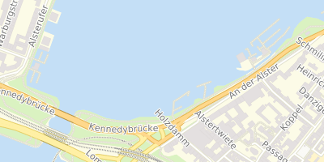
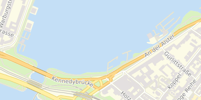

Magnacarto
==========

Magnacarto is a CartoCSS map style processor that generates Mapnik XML and MapServer map files.

It is released as open source under the [Apache License 2.0][].

[Apache License 2.0]: http://www.apache.org/licenses/LICENSE-2.0.html

The development of Magnacarto is sponsored by [Omniscale](http://omniscale.com/) and development will continue as resources permit.
Please get in touch if you need commercial support or if you need specific features.

Features
--------

* Generate styles for Mapnik 2/3 and MapServer

#### MapServer

#### Mapnik

Current status
--------------

- Supports nearly all features of CartoCSS
  - Attachments
  - Instances
  - Classes
  - Color functions
  - Expressions
  - etc.
- Can successfully convert complex styles (like the OSM Carto style)

### Missing ###

- Regexp filters
- Not all CartoCSS features are supported by the MapServer builder
- Improved configuration
- ...

Installation
------------

### Binary

There are binarie releases available for Windows, Linux and Mac OS X (Darwin): http://download.omniscale.de/magnacarto/rel/

### Source

There are some dependencies:

#### Compiler

You need [Go](http://golang.org).

#### Go libraries

Magnacarto uses the following libraries.

- <https://github.com/BurntSushi/toml>
- <https://gopkg.in/fsnotify.v1>

The tests require:

- <https://github.com/omniscale/go-mapnik>
- <https://github.com/stretchr/testify/assert>

`go get` will fetch these, but you can also use [godep][] to use a provided (vendorized) set of these dependencies.

[godep]: https://github.com/tools/godep

#### Other

Fetching Magnacarto requires [git][].

[git]: http://git-scm.com/

#### Compile

Create a new [Go workspace](http://golang.org/doc/code.html):

    mkdir magnacarto
    cd magnacarto
    export GOPATH=`pwd`

Get Magnacarto and all dependencies:

    go get github.com/omniscale/magnacarto/cmd/magnacarto
    go install github.com/omniscale/magnacarto/cmd/magnacarto

Done. You should now have a `magnacarto` binary in `$GOPATH/bin`.

Go compiles to static binaries and so Magnacarto has no runtime dependencies to Go.
Just copy the `magnacarto` binary to your server for deployment.

##### Godep

Magnacarto contains a fixed set of the dependencies that are known to work. You need to install Magnacarto with [godep][] to compile with this set. First create a `GOPATH` (see above), then call the following commands:

    cd $GOPATH
    git clone https://github.com/omniscale/magnacarto src/github.com/omniscale/magnacarto
    cd src/github.com/omniscale/magnacarto
    godep go generate github.com/omniscale/go-mapnik
    godep go install ./...

Usage
-----

`magnacarto` takes a single `-mml` file.

    magnacarto -mml project.mml > /tmp/magnacarto.xml

To build a MapServer map file:

    magnacarto -builder mapserver -mml project.mml > /tmp/magnacarto.map

See `magnacarto -help` for more options.

Documentation
-------------

Refer to the [Carto project](https://github.com/mapbox/carto) for documentation of the CartoCSS format.

- https://github.com/mapbox/carto/blob/master/docs/latest.md
- https://www.mapbox.com/tilemill/docs/crashcourse/styling/

Refer to the following CartoCSS projects for example .mml and .mss files.

- https://github.com/mapbox/osm-bright
- https://github.com/gravitystorm/openstreetmap-carto

Please note that openstreetmap-carto relies on a few advanced Mapnik features that are not supported by Mapserver. Future versions of Magnacarto might work around these limitations.

Support
-------

Please use GitHub for questions: <https://github.com/omniscale/magnacarto/issues>

For commercial support [contact Omniscale](http://omniscale.com/contact).

Development
-----------

The latest developer documentation can be found here: <http://godoc.org/github.com/omniscale/magnacarto>

The source code is available at: <https://github.com/omniscale/magnacarto/>

You can report any issues at: <https://github.com/omniscale/magnacarto/issues>

### Test ###

#### Unit tests ####

    go test -short ./...

#### Regression tests ####

There are regression tests that generate Mapnik and MapServer map files, renders images and compares them.
These tests require Image Magick (`compare`) and MapServer >=7 (`shp2img`).

    go test ./...
